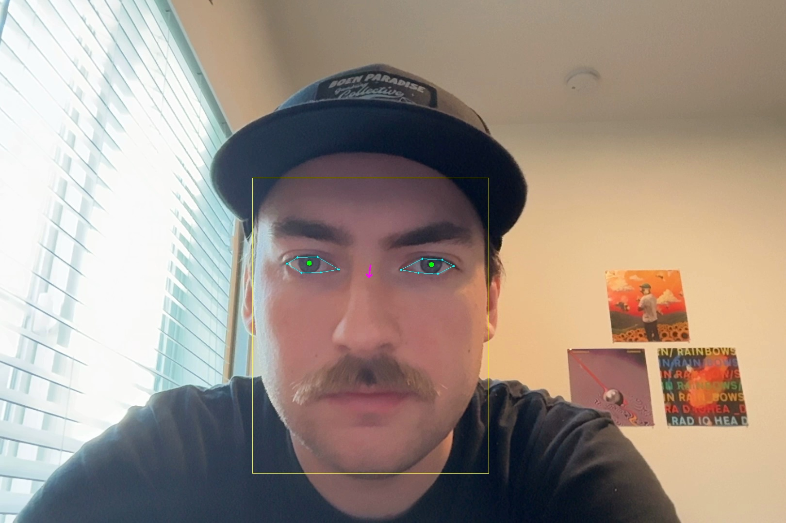
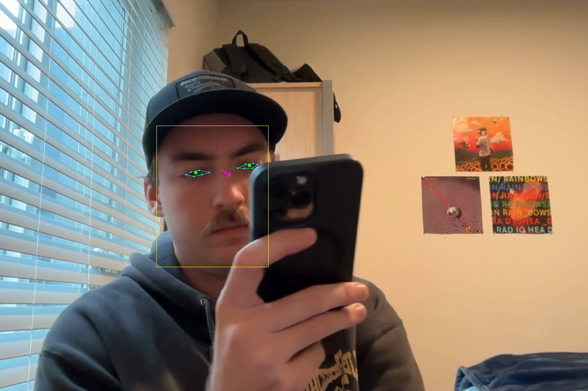

# Focus Detection via Computer Vision

A machine learning system that classifies human attention states (**focused** vs. **distracted**) using facial landmark analysis and temporal modeling.

This senior project explores how visual attention signals (eye aspect ratio, gaze direction in the face frame, head orientation, and face bounding-box position) can be used to detect cognitive focus from video.

| Focused | Distracted |
| :---: | :---: |
|  |  |

Sample frames from the dataset with the feature overlay drawn by [annotate_frames.py](annotate_frames.py): cyan eye polylines, green iris centers, yellow face bounding box, magenta head z-axis. The same overlay is shown live in [realtime.py](realtime.py) (toggle with `M`).

---

## Overview

The project processes labeled video recordings, extracts facial landmarks with MediaPipe, and trains several classifiers to predict attention state. It includes a real-time webcam mode that runs the trained models on a live stream.

### Why This Matters

Attention detection has practical applications in:
- Driver drowsiness monitoring systems
- Student engagement analysis in educational settings
- Productivity tracking tools
- Human-computer interaction research
- Accessibility technologies

---

## Project Pipeline

```
Video Input
    ↓
Frame Extraction (15 fps, 10 seconds → 150 frames)
    ↓
Facial Landmark Detection (MediaPipe, 478 landmarks)
    ↓
Feature Engineering (EAR, gaze in face frame, head z-axis, face bbox)
    ↓
Dataset Generation (temporal sequences + aggregated features)
    ↓
Model Training (Logistic Regression / Temporal CNN / Transformer)
    ↓
Classification (focused / distracted)
    ↓
Real-time Inference (live webcam)
```

---

## Features

### Core Capabilities

- **Video Processing**: 15 fps over 10 seconds (150 frames per clip)
- **Facial Landmark Extraction**: MediaPipe Face Landmarker (478 landmarks including iris)
- **Feature Engineering**: EAR, iris position projected into a face-aligned reference frame, head z-axis, and face bounding-box corners
- **Three Dataset Variants** (each as both temporal NPZ and aggregated CSV):
  - `dataset.csv` / `sequence_dataset.npz` — 6 per-frame features (EAR + raw eye centers)
  - `dataset_iris.csv` / `sequence_dataset_iris.npz` — 6 per-frame features (EAR + normalized iris position)
  - `dataset_gaze.csv` / `sequence_dataset_gaze.npz` — 16 per-frame features (EAR + face-frame gaze + head + bbox)
- **Multiple Models**: Logistic regression (aggregated + flattened), 1D temporal CNN, transformer encoder
- **Real-time Inference**: Live webcam mode with on-the-fly model switching
- **Cross-Validation**: 5-fold stratified for single-run evaluation; multi-seed benchmarking script

### Per-Frame Features (gaze variant, 16 dims)

- `left_ear`, `right_ear` — eye aspect ratio (eye openness)
- `left_gaze_x/y`, `right_gaze_x/y` — iris position in face-aligned 2D frame
- `head_x`, `head_y` — face z-axis projected to image plane (head pose proxy)
- Four face bounding-box corners (x, y each)

---

## Project Structure

```
.
├── frame_extraction.py       # Video → landmarks → features (all dataset variants)
├── annotate_frames.py        # Debug tool: draw gaze arrows on extracted frames
├── baseline_model.py         # Logistic regression on aggregated CSV features
├── time_model.py             # Logistic regression on flattened temporal sequences
├── cnn_time_model.py         # 1D temporal CNN
├── transformer_model.py      # Transformer encoder with positional encoding
├── benchmark.py              # Multi-seed comparison across models × datasets
├── realtime.py               # Live webcam inference (switch models with Tab)
├── requirements.txt
├── face_landmarker.task      # MediaPipe model weights (required)
├── dataset*.csv              # Aggregated features (generated)
├── sequence_dataset*.npz     # Temporal sequences (generated)
├── baseline_model.pkl        # Saved logistic regression (generated via --save)
├── cnn_model.pt              # Saved temporal CNN (generated via --save)
├── transformer_model.pt      # Saved transformer (generated via --save)
└── videos/                   # Video dataset (download separately)
    ├── focused/
    └── distracted/
```

Large files (videos, model weights, generated datasets) are excluded from version control via `.gitignore`.

---

## Installation

### Prerequisites

- Python 3.11
- pip
- virtualenv (recommended)

### Setup

1. **Clone the repository**:
   ```bash
   git clone <your-repo-url>
   cd <repo-name>
   ```

2. **Create and activate a virtual environment**:
   ```bash
   python -m venv venv
   source venv/bin/activate  # On Windows: venv\Scripts\activate
   ```

3. **Install dependencies**:
   ```bash
   pip install -r requirements.txt
   ```

4. **Download the MediaPipe model**:
   Download `face_landmarker.task` from [MediaPipe Face Landmarker](https://developers.google.com/mediapipe/solutions/vision/face_landmarker) and place it in the project root.

---

## Dataset

Labeled video recordings of individuals in focused and distracted states.

### Download Dataset

The full dataset is hosted on Kaggle:

**[Focus Detection Dataset](https://www.kaggle.com/datasets/jaredhammett/focused-vs-distracted)**

### Setup Instructions

1. Download the dataset from Kaggle
2. Extract `videos.zip`
3. Place the `videos/` folder in the project root:
   ```
   videos/
   ├── focused/
   └── distracted/
   ```

The dataset is NOT included in this repository due to size constraints.

---

## Usage

### 1. Extract Features

Process all videos in `videos/` to generate the three dataset variants:

```bash
python frame_extraction.py
```

**Outputs**:
- `sequence_dataset.npz` + `dataset.csv` (legacy 6-feature)
- `sequence_dataset_iris.npz` + `dataset_iris.csv` (normalized iris)
- `sequence_dataset_gaze.npz` + `dataset_gaze.csv` (face-frame gaze, 16 features)

Already-processed videos are skipped on subsequent runs.

### 2. Evaluate Models (5-fold CV)

```bash
python baseline_model.py          # logistic regression on aggregated CSV
python time_model.py              # logistic regression on flattened sequences
python cnn_time_model.py          # 1D temporal CNN
python transformer_model.py       # transformer encoder
```

Each script reports mean ± std accuracy and macro F1 across 5 folds.

### 3. Benchmark All Models

Run every model against every dataset variant with multiple seeds:

```bash
python benchmark.py
```

Reports mean ± std accuracy and macro F1 across `N_RUNS × N_FOLDS` (default 10 × 5).

### 4. Save Trained Models for Real-time Use

```bash
python baseline_model.py --save     # → baseline_model.pkl
python cnn_time_model.py --save     # → cnn_model.pt
python transformer_model.py --save  # → transformer_model.pt
```

By default all three train on `dataset_gaze.csv` / `sequence_dataset_gaze.npz`. Pass `--csv` or `--npz` to override.

### 5. Real-time Webcam Inference

```bash
python realtime.py                  # use default camera
python realtime.py --camera 1       # specify camera index
python realtime.py --list-cameras   # list available camera indices
```

**Controls**:
- `Q` — quit
- `M` — toggle facial landmark overlay
- `Tab` — cycle through loaded models

The viewer collects a 150-frame (10-second) sliding window at 15 fps, then predicts continuously. Predictions are smoothed with a 3-frame majority vote.

### 6. Debug Visualization

Annotate extracted frames with gaze arrows for inspection:

```bash
python annotate_frames.py                   # all videos in videos/
python annotate_frames.py path/to/video.mp4 # single video
```

Output goes to `frames_annotated/`.

---

## Models

### 1. Baseline (`baseline_model.py`)

Logistic regression on aggregated per-video statistics (mean, std, variance of EAR / gaze / head / bbox features). Auto-detects which feature set the input CSV provides.

### 2. Flattened Sequence (`time_model.py`)

Logistic regression on the full temporal sequence flattened to a single vector. Preserves frame-level information but doesn't model temporal structure explicitly.

### 3. Temporal CNN (`cnn_time_model.py`)

Two 1D convolutional layers (16 → 32 channels, kernel size 3) followed by adaptive average pooling and a linear classifier. Early stopping with patience 15.

### 4. Transformer (`transformer_model.py`)

Linear projection (input → 64), learnable positional encoding, 2-layer transformer encoder (4 heads), mean pooling over time, linear classifier. Dropout 0.1.

---

## Technical Details

### Eye Aspect Ratio (EAR)

```
EAR = (||p2 - p6|| + ||p3 - p5||) / (2 * ||p1 - p4||)
```

Where p1–p6 are the 6 eyelid landmarks. Lower values indicate closed eyes.

### Face-Frame Gaze

For the gaze dataset, iris landmarks are projected into a 3D reference frame built from the face: x-axis between eye corners, y-axis toward the top of the head, z-axis as their cross product. The iris coordinates are normalized by inter-eye distance. This decouples gaze direction from head pose.

### Frame Extraction

- **Frame rate**: 15 fps
- **Duration**: 10 seconds (150 frames)
- **Padding**: shorter sequences are zero-padded

### Training

- 5-fold stratified cross-validation
- StandardScaler (per-feature z-score)
- Adam, lr = 1e-3
- CrossEntropyLoss
- Auto-detects CUDA, CPU fallback

---

## Technologies Used

- **Python 3.11**
- **OpenCV** — video processing
- **MediaPipe** — 478-point facial landmark detection
- **NumPy / Pandas**
- **scikit-learn** — classical models, preprocessing, metrics
- **PyTorch** — CNN and transformer

---

## Performance Notes

The current dataset contains 96 videos (50 focused, 46 distracted). Performance varies by architecture and feature set; `benchmark.py` is the entry point for head-to-head comparisons. Results depend on dataset size, class balance, and recording conditions.

---

## Acknowledgments

- **MediaPipe** by Google for facial landmark detection
- **PyTorch** team for the deep learning framework
- **scikit-learn** contributors for machine learning utilities
